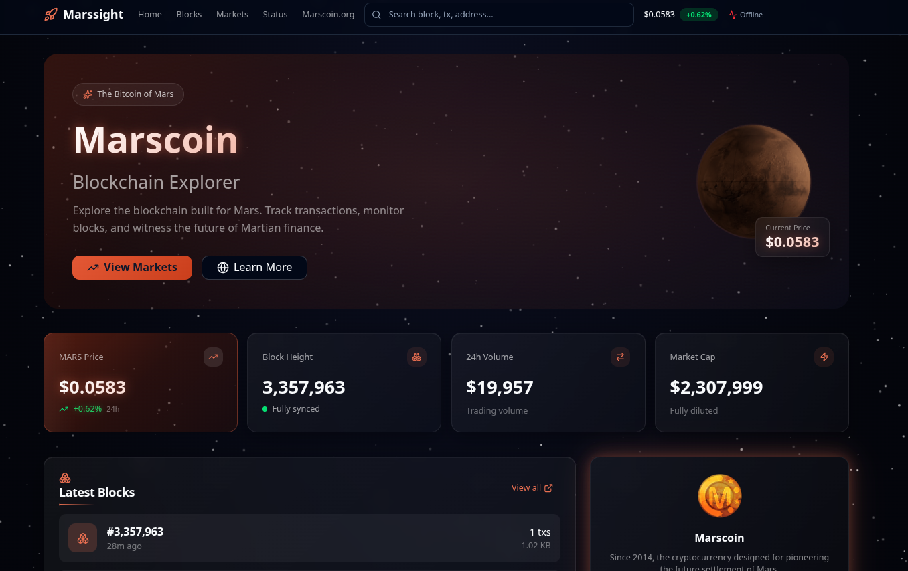

# Marssight - Marscoin Blockchain Explorer

<div align="center">


**The official blockchain explorer for Marscoin - the cryptocurrency designed for Mars colonization**

[Live Explorer](https://explore1.marscoin.org) | [Marscoin.org](https://www.marscoin.org)

</div>

---

## Screenshot



---

## Overview

Marssight is a modern, open-source blockchain explorer for the Marscoin network. Built with a beautiful space-themed UI featuring a 3D rotating Mars globe, real-time block updates, and comprehensive blockchain data visualization.

### Features

- **3D Mars Globe** - Interactive Three.js rendered Mars with real NASA texture
- **Real-time Updates** - WebSocket-powered live block and transaction feeds
- **Modern UI** - Glassmorphism design with space-themed aesthetics
- **Full API** - Complete REST API for blockchain data
- **Price Integration** - Live Marscoin price data
- **Pure JavaScript** - No native addons, runs on any platform
- **Node.js 24+** - Built for modern JavaScript

## Tech Stack

### Frontend (`/frontend`)
- React 18 with TypeScript
- Vite 7 for blazing fast builds
- Tailwind CSS v4 for styling
- Three.js with React Three Fiber for 3D graphics
- React Query for data fetching

### Backend API (`/api`)
- Node.js 24+ (pure JavaScript modules)
- Express.js REST API
- LevelDB for indexed blockchain data
- Socket.IO for real-time updates
- Pure JS replacements for native modules

## Prerequisites

- **Node.js 24+** - Required for ES modules and modern JavaScript features
- **npm 11+** - Comes with Node.js 24
- **Marscoin Core** - Running full node with RPC enabled

### Marscoin Node Configuration

Ensure your `~/.marscoin/marscoin.conf` has:

```conf
rpcuser=marscoinrpc
rpcpassword=your_secure_password
rpcport=9981
rpcallowip=127.0.0.1
txindex=1
```

## Quick Start

### 1. Clone the repository

```bash
git clone https://github.com/marscoin/Marssight.git
cd Marssight
```

### 2. Install dependencies

```bash
# Install all dependencies (frontend + api)
npm run install:all

# Or install separately:
cd frontend && npm install
cd ../api && npm install
```

### 3. Start the backend API

```bash
INSIGHT_NETWORK=livenet \
BITCOIND_PASS=your_rpc_password \
INSIGHT_FORCE_RPC_SYNC=true \
npm run start:api
```

### 4. Start the frontend (in another terminal)

```bash
npm run start:frontend
```

### 5. Open your browser

- **Frontend**: http://localhost:5173
- **Backend API**: http://localhost:4005

## Environment Variables

### Backend (API)

| Variable | Description | Default |
|----------|-------------|---------|
| `INSIGHT_NETWORK` | Network mode (`livenet` or `testnet`) | `testnet` |
| `INSIGHT_PORT` | API server port | `4005` (livenet) |
| `BITCOIND_USER` | RPC username | `marscoinrpc` |
| `BITCOIND_PASS` | RPC password | - |
| `BITCOIND_HOST` | RPC host | `127.0.0.1` |
| `BITCOIND_PORT` | RPC port | `9981` (livenet) |
| `INSIGHT_FORCE_RPC_SYNC` | Force RPC sync mode | `false` |

## API Endpoints

### Blocks
```
GET /api/block/:hash          # Get block by hash
GET /api/block-index/:height  # Get block hash by height
GET /api/blocks               # Get blocks list
```

### Transactions
```
GET /api/tx/:txid             # Get transaction by ID
GET /api/txs                  # Get transactions list
GET /api/rawtx/:txid          # Get raw transaction
```

### Addresses
```
GET /api/addr/:address        # Get address info
GET /api/addr/:address/utxo   # Get address UTXOs
GET /api/addr/:address/balance # Get address balance
```

### Status
```
GET /api/sync                 # Get sync status
GET /api/status               # Get node status
```

## Project Structure

```
Marssight/
├── frontend/                 # React frontend
│   ├── src/
│   │   ├── components/       # React components
│   │   ├── pages/            # Page components
│   │   ├── services/         # API services
│   │   └── hooks/            # Custom hooks
│   └── public/               # Static assets
├── api/                      # Backend API
│   ├── app/                  # Controllers & models
│   ├── lib/                  # Pure JS modules
│   ├── config/               # Configuration
│   ├── test/                 # Test suite
│   └── insight.js            # Entry point
├── docs/                     # Documentation
└── README.md
```

## Development

### Frontend Development
```bash
cd frontend
npm run dev     # Start dev server with hot reload
npm run build   # Build for production
npm run lint    # Run ESLint
```

### API Testing
```bash
cd api
npm run test:pure   # Run pure JS module tests
```

## About Marscoin

Marscoin is a cryptocurrency designed for the future settlement of Mars. Established in 2014, it serves as a testbed for blockchain technology that could facilitate Martian commerce and governance.

- **Algorithm**: Scrypt
- **Block Time**: ~2 minutes
- **Merged Mining**: Yes (with Litecoin)
- **Difficulty**: ASERT (Aserti3-2d)

Learn more at [marscoin.org](https://www.marscoin.org)

## Contributing

We welcome contributions! Please follow these steps:

1. Fork the repository
2. Create a feature branch (`git checkout -b feature/amazing-feature`)
3. Commit your changes (`git commit -m 'Add amazing feature'`)
4. Push to the branch (`git push origin feature/amazing-feature`)
5. Open a Pull Request

## License

MIT License - see [LICENSE](LICENSE) for details.

---

<div align="center">

Built with love for Mars

*"Wake up and do something that excites you"*

</div>
